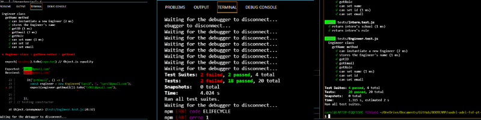
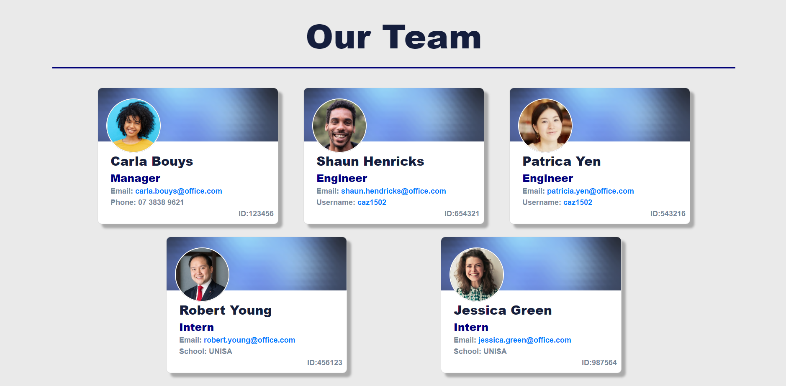

# Team_Profile_Generator


## Description

```md
This application generates a html Team Profile page, using answers from questions via the VS command prompt, by executing node app.js
```


## The Task

```md
Build a Node.js command-line application that takes in information about employees on a software engineering team, then generates an HTML webpage that displays summaries for each person.
```


## User Story

```md
AS A manager
I WANT to generate a webpage that displays my team's basic info
SO THAT I have quick access to their emails and GitHub profiles.
```


## Acceptance Criteria

```md
GIVEN a command-line application that accepts user input
WHEN I am prompted for my team members and their information
THEN an HTML file is generated that displays a nicely formatted team roster based on user input
WHEN I click on an email address in the HTML
THEN my default email program opens and populates the TO field of the email with the address
WHEN I click on the GitHub username
THEN that GitHub profile opens in a new tab
WHEN I start the application
THEN I am prompted to enter the team manager’s name, employee ID, email address, and office number
WHEN I enter the team manager’s name, employee ID, email address, and office number
THEN I am presented with a menu with the option to add an engineer or an intern or to finish building my team
WHEN I select the engineer option
THEN I am prompted to enter the engineer’s name, ID, email, and GitHub username, and I am taken back to the menu
WHEN I select the intern option
THEN I am prompted to enter the intern’s name, ID, email, and school, and I am taken back to the menu
WHEN I decide to finish building my team
THEN I exit the application, and the HTML is generated
```


## Langauages


   


---


## Images / Video


Unit testing -Youtube link

[Tests Video](https://www.youtube.com/watch?v=04SrdviitR0)


Using the application -Youtube link

[Using the application Video](https://www.youtube.com/watch?v=stgZ8oZj7vc)


Fail and Pass Test Image




Team Profile Image




---

## License

  [MIT](https://opensource.org/licenses/MIT/)


---

## Authors, Acknowledgement, & Resources 🤝

```md
Teaching Crew at UniSA Coding Bootcamp 🎉
W3Schools 
GitHub 
Google
Canva - Photo editing
Youtube - Video editing and reference
Snagit - Video
Windows - Photo/video editor
```


